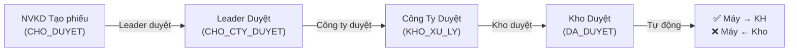

# PLAN: Đề Nghị Xuất Máy - Luồng Duyệt & Tích Hợp Kho/Máy

## Tổng quan

Cải tiến toàn diện module "Đề nghị xuất máy" (ĐNXM) với luồng duyệt 4 cấp mới, thông báo real-time qua chuông, và tự động đồng bộ máy ↔ kho ↔ khách hàng khi phiếu được duyệt xong.

---

## Luồng duyệt mới (4 cấp)



| Bước | Trạng thái DB | Ai duyệt | Hành động |
|------|--------------|-----------|-----------|
| 1 | `CHO_DUYET` | NVKD tạo phiếu | Phiếu mới được tạo |
| 2 | `CHO_CTY_DUYET` | Leader (Lead Sale / Trưởng KD) | Leader xem + duyệt/sửa/từ chối |
| 3 | `KHO_XU_LY` | Công ty (Admin / Giám đốc) | Công ty xem + duyệt/sửa/từ chối |
| 4 | `DA_DUYET` | Kho (Thủ kho) | Kho duyệt + **tự động cập nhật máy** |

---

## Phase 1: Sửa luồng duyệt

### Tệp cần sửa

#### [MODIFY] [MachineIssueRequestForm.jsx](file:///c:/Users/dungv/PlasmaVN_Acc/src/components/Machines/MachineIssueRequestForm.jsx)

**1.1 Sửa `handleApproveStatus`** — Thay đổi luồng chuyển trạng thái:

| Trạng thái hiện tại | → Trạng thái tiếp | Nhãn nút | Ai được duyệt |
|---------------------|--------------------|----------|----------------|
| `CHO_DUYET` | `CHO_CTY_DUYET` | "Leader Duyệt (1/4)" | Admin, Lead Sale, Trưởng KD |
| `CHO_CTY_DUYET` | `KHO_XU_LY` | "Công ty Duyệt (2/4)" | Admin, Giám đốc |
| `KHO_XU_LY` | `DA_DUYET` | "Kho Duyệt (3/4)" | Admin, Thủ kho |
| `DA_DUYET` | — | Hoàn tất | Không duyệt thêm |

**1.2 Cho phép chỉnh sửa ở mọi bước:**
- Hiện tại chỉ NVKD (người tạo) mới sửa được.
- Cần cho phép mọi cấp đều có thể **chỉnh sửa phiếu** (nhấn "Chỉnh sửa" → mở form nhập liệu).
- Khi bất kỳ ai sửa phiếu → gửi notification.

**1.3 Cập nhật nút duyệt hiển thị trên ViewOnly:**
- Hiện tại `isReadOnly` che form nhập liệu → cần thêm nút "Chỉnh sửa" bên cạnh nút "Duyệt" và "Từ chối".
- Nhấn "Chỉnh sửa" → chuyển sang chế độ edit (tắt `isReadOnly`).

---

## Phase 2: Thông báo chuông (Notifications)

### Yêu cầu
- Mỗi hành động (tạo, sửa, duyệt, từ chối) → tạo 1 bản ghi trong bảng `notifications`.
- Nhấn vào thông báo trên quả chuông → **navigate đến phiếu cụ thể** (link = `/de-nghi-xuat-may/tao?orderId={id}&viewOnly=true`).

### Thay đổi cần làm

#### [MODIFY] [MachineIssueRequestForm.jsx](file:///c:/Users/dungv/PlasmaVN_Acc/src/components/Machines/MachineIssueRequestForm.jsx)

**2.1 Cập nhật `link` trong `notificationService.add()`:**

Hiện tại link là `/de-nghi-xuat-may` (trang danh sách) → Sửa thành `/de-nghi-xuat-may/tao?orderId={orderId}&viewOnly=true` để nhấn chuông → vào **đúng phiếu**.

**2.2 Thêm notification cho từng hành động:**

| Hành động | Emoji | Title | Description |
|-----------|-------|-------|-------------|
| NVKD tạo mới | 💡 | "ĐNXM mới: {tên KH}" | "NV {tên} vừa lập phiếu đề nghị xuất máy" |
| Bất kỳ ai sửa | 📝 | "Cập nhật ĐNXM: {tên KH}" | "NV {tên} vừa chỉnh sửa phiếu ĐNXM" |
| Leader duyệt (1/4) | ✅ | "Leader đã duyệt ĐNXM" | "Phiếu {mã} chuyển sang Công ty duyệt" |
| Công ty duyệt (2/4) | ✅ | "Công ty đã duyệt ĐNXM" | "Phiếu {mã} chuyển sang Kho xử lý" |
| Kho duyệt (3/4) | 🏭 | "Kho đã duyệt xuất máy" | "Phiếu {mã} hoàn tất. Máy đã giao cho {KH}" |
| Từ chối | ❌ | "ĐNXM bị từ chối" | "Phiếu {mã} đã bị từ chối" |

---

## Phase 3: Máy → Khách hàng + Máy ← Kho

### Yêu cầu
Khi **Kho duyệt xong** (status → `DA_DUYET`):
1. Lấy danh sách mã máy (`machineCode`) từ phiếu (VD: "PLT-001, PLT-002").
2. Cập nhật bảng `machines`:
   - `status`: `"sẵn sàng"` → `"thuộc khách hàng"`
   - `customer_name`: gán tên khách hàng từ phiếu ĐNXM

### Thay đổi cần làm

#### [MODIFY] [MachineIssueRequestForm.jsx](file:///c:/Users/dungv/PlasmaVN_Acc/src/components/Machines/MachineIssueRequestForm.jsx)

**3.1 Thêm hàm `assignMachinesToCustomer()`:**
```javascript
const assignMachinesToCustomer = async (machineCodes, customerName) => {
    const codes = machineCodes.split(',').map(c => c.trim()).filter(Boolean);
    if (codes.length === 0) return;
    
    for (const code of codes) {
        await supabase
            .from('machines')
            .update({
                status: 'thuộc khách hàng',
                customer_name: customerName
            })
            .eq('serial_number', code);
    }
};
```

**3.2 Gọi hàm này trong `handleApproveStatus()` khi `nextStatus === 'DA_DUYET'`:**
```javascript
case 'KHO_XU_LY':
    nextStatus = 'DA_DUYET';
    // Sau khi update status thành công:
    await assignMachinesToCustomer(formData.machineCode, formData.customerName);
    break;
```

---

## Phase 4: Tổng kết các thay đổi

| File | Thay đổi |
|------|----------|
| `MachineIssueRequestForm.jsx` | Sửa luồng duyệt, thêm nút chỉnh sửa, cập nhật notifications, thêm auto-assign máy |

> [!IMPORTANT]
> Không cần tạo file mới hay thay đổi DB schema. Tất cả logic nằm trong `MachineIssueRequestForm.jsx`.

---

## Verification Plan

### Manual Testing
- [ ] **Tạo phiếu mới** → Kiểm tra notification + link chuông
- [ ] **Leader duyệt** → Status chuyển `CHO_CTY_DUYET`, notification xuất hiện
- [ ] **Công ty duyệt** → Status chuyển `KHO_XU_LY`, notification xuất hiện
- [ ] **Kho duyệt** → Status chuyển `DA_DUYET`, máy cập nhật `thuộc khách hàng` + `customer_name`
- [ ] **Chỉnh sửa ở mỗi bước** → notification "Cập nhật" xuất hiện, nhấn chuông → đúng phiếu
- [ ] **Từ chối** → Status chuyển `TU_CHOI`, notification xuất hiện
- [ ] **Kiểm tra bảng machines** → Máy đã chuyển trạng thái và gán khách đúng

---

## Agent Assignment

| Phase | Agent | Skill |
|-------|-------|-------|
| Phase 1-3 | `frontend-specialist` | `nextjs-react-expert`, `clean-code` |

---

## Trạng thái

- [x] Phase -1: Context Check (Nghiên cứu codebase)
- [x] Phase 0: Socratic Gate (Làm rõ yêu cầu)
- [ ] Phase 1: Sửa luồng duyệt
- [ ] Phase 2: Thông báo chuông
- [ ] Phase 3: Máy → KH + Máy ← Kho
